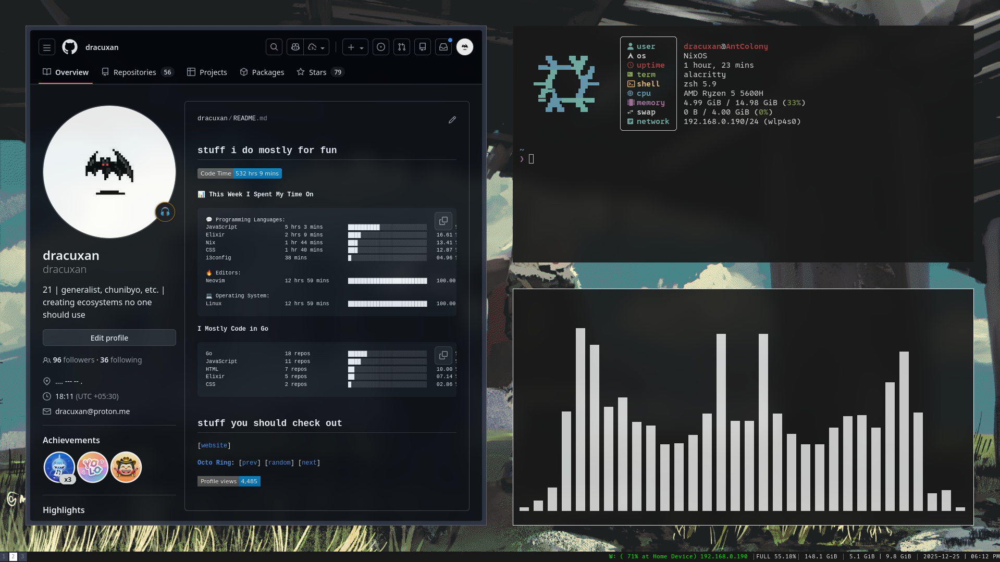
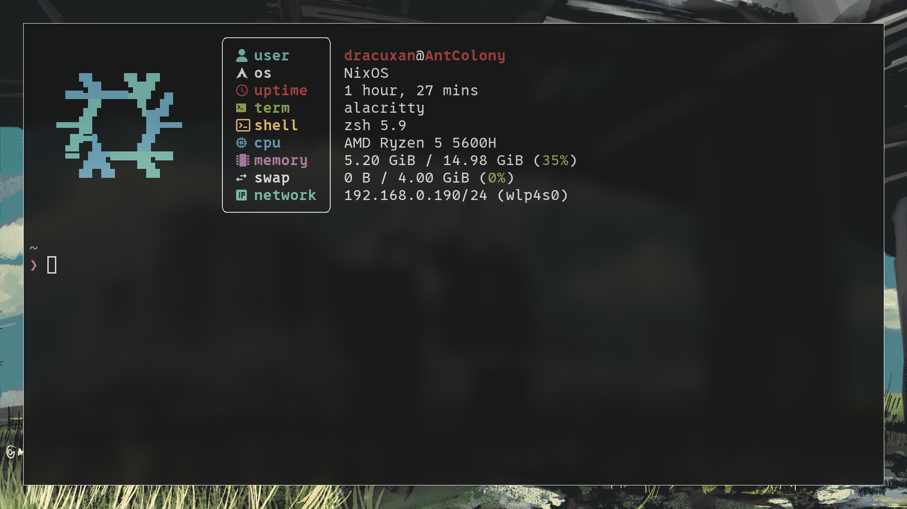
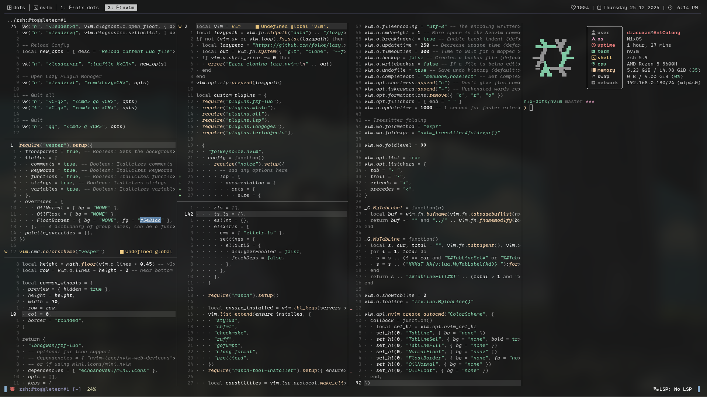

# NixOS Flake Dotfiles Setup

> [!WARNING]\
> This is a personal configuration. Everything is FAFO - use at your own risk.

This repo contains my NixOS system and Home Manager configurations.

> [!WARNING]\
> These configs assume NVIDIA GPU, specific hardware, and may break on different setups.

## Prerequisites (after a fresh NixOS install)

### Enable flakes and nix-command

Add to `/etc/nixos/configuration.nix`:

```nix
nix = {
    package = pkgs.nixVersions.stable;
    extraOptions = "experimental-features = nix-command flakes";
};
```

Then apply using:

```bash
sudo nixos-rebuild switch
```

## Installation

1. Clone the repo:

```bash
git clone https://github.com/dracuxan/nix-dots.git ~/nix-dots && cd ~/nix-dots
```

2. Run installation script to stow configs:

```bash
make install
```

3. Apply NixOS configuration:

```bash
make build
```

## Available Commands

> [!NOTE]
> use these in sudo

```bash
make build    # Apply NixOS configuration
make update   # Update flake inputs
make clean    # Clean up old generations
make install  # Stow configuration files
```

## Configured Tools

- **i3** - Tiling window manager
- **alacritty** - Terminal emulator
- **nvim** - Neovim with LSP and plugins
- **zsh** - Shell with aliases and vim keybindings
- **tmux** - Terminal multiplexer
- **picom** - Compositor with blur
- **fastfetch** - System information

## Scripts Usage

### Development Scripts

- **run.sh** - Universal run script supporting C, Python, Go, Rust, Elixir, HTML, Shell scripts

  > [!NOTE]
  > supports `build-only` flag only for Go

  ```bash
  run.sh main.go --build-only  # Build Go without running
  run.sh <file>                # Auto-detect and run for other languages
  ```

- **gen_clangd.sh** - Generate LSP configuration for C/C++ in Nix environments
  ```bash
  gen_clangd.sh                # Creates .clangd file for Nix include paths
  ```

### System Scripts

- **setup_monitors.sh** - Dual monitor setup with auto-detection

  ```bash
  setup_monitors.sh            # Auto-detect and setup (external on left)
  setup_monitors.sh --right    # Place external monitor on right
  setup_monitors.sh --above    # Place external above
  setup_monitors.sh --dry-run  # Preview changes without applying
  ```

- **set_wallpaper.sh** - Comprehensive wallpaper management

  ```bash
  set_wallpaper.sh             # Set from config file
  set_wallpaper.sh img.jpg     # Set specific wallpaper
  set_wallpaper.sh --random    # Random from ~/Wallpapers
  set_wallpaper.sh --list      # List available wallpapers
  ```

- **start_tmux.sh** - Tmux session manager with logging
  ```bash
  start_tmux.sh                # Attach to existing or create new session
  start_tmux.sh --new          # Force creation of new session
  start_tmux.sh --n            # Force creation of new session
  ```

## Dependencies

### System Packages (Managed by Nix)

The configuration automatically installs core tools for:

- Development environments and compilers
- System utilities and display management
- Desktop environment (i3, alacritty, etc.)
- Fonts and essential applications

### Manual Setup Required

#### Plugin Installation

```bash
# Tmux Plugin Manager (TPM)
git clone https://github.com/tmux-plugins/tpm ~/.tmux/plugins/tpm

# ZSH autosuggestions
git clone https://github.com/zsh-users/zsh-autosuggestions ~/.zsh/zsh-autosuggestions
```

#### Directory Structure

- `~/Wallpapers/` (for wallpaper script)
- `~/.tmux_logs/` (for tmux session logging)

#### Enabled Services

Docker, PostgreSQL, PipeWire audio, and Bluetooth are configured and auto-started.

## Screenshots

### i3 Window Manager



### Alacritty Terminal



### Neovim



## Folder Structure

```
nix-dots/
├── alacritty/           # Terminal config
├── fastfetch/          # System info config
├── i3/                 # Window manager config
├── i3status/           # Status bar config
├── nvim/               # Neovim config and plugins
├── picom/              # Compositor config
├── scripts/            # Utility scripts
├── tmux/               # Terminal multiplexer config
├── zsh/                # Shell configuration
├── flake.lock          # Dependency lock file
├── flake.nix           # Main flake config
├── home.nix            # Home manager config
├── configuration.nix   # NixOS system config
├── Makefile            # Build commands
└── install.sh          # Installation script
```
