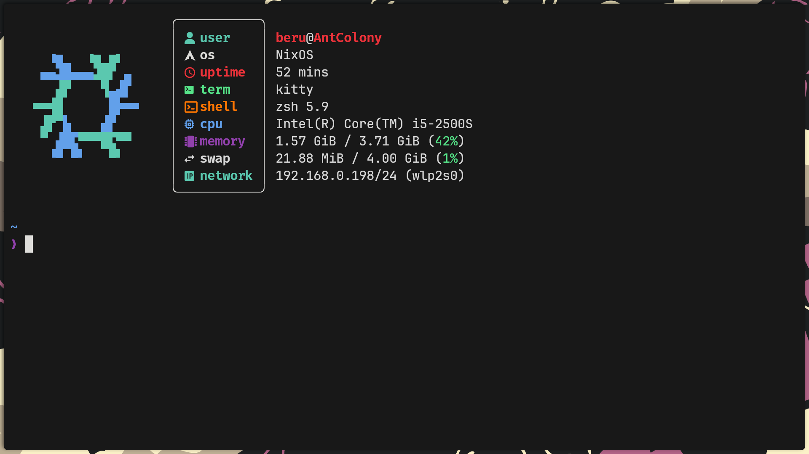
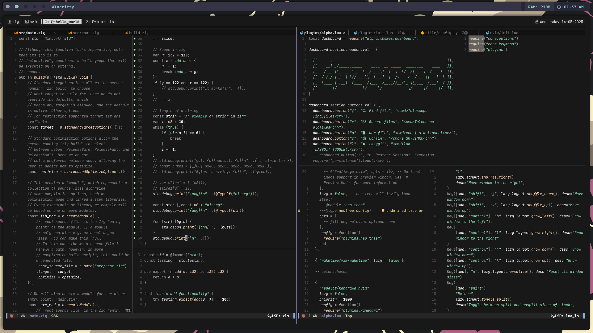

# NixOS Flake Dotfiles Setup

This repo contains my NixOS system and Home Manager configurations using flakes.

## Prerequisites (after a fresh NixOS install)

### Enable flakes and nix-command

Add to `/etc/nixos/configuration.nix`:

```bash
nix = {
    package = pkgs.nixVersions.stable;
    extraOptions = "experimental-features = nix-command flakes";
};
```

Then apply using:

```
sudo nios-rebuild switch
```

## Installation Steps

1. Clone the repo:

```bash
git clone https://github.com/dracuxan/nix-dots.git ~/nix-dots && cd ~/nix-dots
```

2. Run the flake build

```bash
sudo nixos-rebuild switch --flake .#hostname
```

> **Note:** you can also edit the makefile for smaller commands

## Home Manager (via flake)

Home Manager is integrated via `home-manager.users.<username> = import ./home.nix;`.

It will automatically configure user-level settings (e.g., `nvim`, `zsh`, `alacritty`, etc.) when you run the `nixos-rebuild`.

## Folder Structure

```bash
nix-dots/
├── alacritty/
├── fastfetch/
├── nvim/
├── qtile/
├── starship/
├── zsh/
│
├── flake.lock
├── flake.nix
├── home.nix
├── configuration.nix
├── hardware-configuration.nix
│
├── Makefile
├── README.md
└── result -> symlink to current home-manager generation
```

## Screenshots



